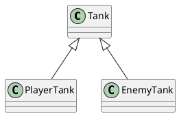
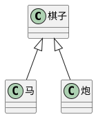

# 为什么要学习TypeScript

- 就业 或者 获得更大的竞争优势
- 获得更好的开发体验
- 解决js中一些难以处理的问题

## JS开发中的问题

- 使用了不存在的变量、函数或成员
- 把一个不确定的类型当成一个确定的类型来进行处理
- 在使用null或undefined的成员

## js的原罪

- js语言本身的特性，决定了该语言无法适应大型的复杂的项目
- 弱类型：某个变量，可以随时更换类型
- 解释性：错误发生的时间，是在运行时

前端开发中，大部分的时间都是在排错

# TypeScript

简称TS

TypeScript是JS的超集，是一个可选的、静态的类型系统

- 超集

  整数、正整数，整数是正整数的超集

- 类型系统

  对代码中所有的标识符（变量、函数、参数、返回值）进行类型检查

- 可选的

  学习曲线非常平滑，即ts中新增的内容在开发过程中可用可不用

- 静态的

  无论是浏览器环境，还是node环境，无法直接识别ts代码

  > babel：es6 -> es5

  > tsc：ts -> js

  tsc：ts编译器

  静态：类型检查发生的时间，在编译的时候，而非运行时

  TS不参与任何运行时的类型检查

## TS的常识

- 2012年微软发布
- Anders Hejlsberg   负责开发TS项目
- 开源、拥抱ES标准
- 版本，[目前为4.3](https://www.typescriptlang.org/)
- [中文官网](https://www.tslang.cn/)    个人翻译

## 额外的惊喜

有了类型的检查，增强了面向对象给的开发

js中也有类和对象，js支持面向对象开发。没有类型检查，很多面向对象的场景实现起来有诸多问题。

使用TS后，可以编写出完善的面向对象代码

# node环境搭建ts开发环境

## 安装TypeScript

建议全局安装

```shell
npm install -g typescript
```

编译ts文件，在编译完成后，当前目录下会生成一个同名的js文件，即为ts代码的编译结果

```shell
tsc xxx.ts
```

默认情况下，TS会做出下面几种假设

1. 假设当前的执行环境是dom
2. 如果代码中没有使用模块化语句（import、export），便认为改代码是全几乎执行的
3. 编译的目标代码是ES3

有两种方式更改以上假设：

1. 使用tsc命令行的时候，加上选项参数
2. 使用ts配置文件，更改编译选项

## TS的配置文件

通过`tsc --init`可自动生成ts配置文件，一下为一些简单配置

```json
{
  "compilerOptions": {
    "target": "es2016",//配置编译目标代码的版本标准
    "module": "CommonJS",//配置编译目标使用的模块化标准 commonjs或es6
    "lib": ["es2016"],//配置代码编写时的宿主环境，node需要通过安装@types/node来进行额外配置，一般情况下不会配置dom环境
    "outDir": "./dist"//指定编译结果存放目录
  },
  "include": ["./src"]//指定编译目录
  // "files": ["./src/index.ts"]//指定编译目标
}
```

使用了配置文件后，使用tsc进行编译时，不能跟上文件名，如果跟上文件名，会忽略文件名，使用方法，直接`tsc`运行

@types/node

@types是一个ts官方的类型库，其中包含了很多对js代码的类型描述

> JQuery：用js写的，没有类型检查
>
> 安装@types/jquery，为jquery库添加类型定义

## 使用第三方库简化流程

ts-node：可以将ts代码在内存中完成编译，同时完成运行

nodemon：用于监测文件的变化`nodemon --exec ts-node <目标文件>`

可通过在package.json中加入一下命令来简化流程

```json
"scripts": {
    "dev": "nodemon --watch src -e ts --exec ts-node src/index.ts"
}
```

在开发完成后通过`tsc`命令来完成最终的编译，生成编译结果

# 基本类型检查

## 基本类型约束

> TS是一个可选的静态的类型系统

### 如何进行类型约束

仅需要在变量、函数的参数、函数的返回值后加上```:类型```即可

```tsx
let name: string;
function sum(a: number, b: string): number|string{
    return a + b;
}
let name: any;
```

ts在很多场景中可以完成类型推导，比如在为一个未约束类型的变量赋值时，赋值的类型就会对该变量产生约束，推导出来的类型与手动约束的类型作用完全一致

any：表示任意类型，对该类型，ts不进行类型检查

> 小技巧，如何区分数字字符串和数字，关键看怎么读，比如手机号、身份证号之类
>
> 如果按照数字的方式朗读，则为数字；否则，为字符串

### 源代码和编译结果的差异

编译结果中没有类型约束的信息

### 基本类型

- number：数字
- string：字符串
- boolean：布尔值
- number[]：数字类型数组，还可写为`Array<number>`
- string[]：字符串类型数组`Array<string>`，还可以是`let arr:(number|string)[]`
- object：对象
- null和undefined

**null和undefined时所有其他类型的子类型，即它可以赋值给其他类型**

**可以在tsconfig.json中的`compilerOptions`下加入`"strictNullChecks": true`来进行约束，从而获得更严格的空类型检查，从此null和undefined只能赋值给自身**

### 其他类型

- 联合类型，多种类型任选其一，通过`|`来连接两种类型，使变量可以约束为多种类型

  可配合类型保护进行判断，类型保护：当对某个变量进行类型判断之后，在判断的语句块中便可以确定它的确切类型

  ```tsx
  let name: string|undefined;
  if(typeof name === "string"){
  	
  }
  ```

- void类型：通常用于约束函数的返回值，表示该函数没有任何返回值

  ```tsx
  function pringMenu():void{
      console.log("登录")
  }
  ```

- never类型：通常用于约束函数的返回值，表示该函数永远不可能结束

  ```tsx
  function throwError(msg:string): never{
      throw new Error(msg);
  }
  ```

- 字面量类型：使用一个值进行约束（一般不会使用该种方式）

  ```tsx
  let a: "A";
  let gender:"男"|"女" = "男";
  let arr: [];//arr永远只能取值为一个空数组
  let user: {
      name: string,
      age: number
  }
  ```

- 元组类型（Tuple）：一个固定长度的数组，并且数组中每一项的类型确定

  ```tsx
  let tu: [string, number];//改数组只能有两项，且第一项必须为字符串，第二项必须为数字
  ```

- any类型：any类型的变量

  ```tsx
  let data: any = "aefdewa";
  let num: number = data;
  console.log(num);
  //any类型可能会出现一些隐患，比如上述代码
  ```

### 类型别名

对已知的一些类型定义名称

`type 类型名 = 自定义类型`

```tsx
type Gender = "男"|"女";
type User = {
    name: string,
    age: number,
    gender: Gender
}
let u:User = {
    name: "wjn",
    age: 25,
    gender: "男"
}
function getUsers(g:Gender):User[]{
    return [];
}
```

### 函数的相关约束

- 函数重载，在函数调用之前，对函数进行多重声明

  ```tsx
  /**
   * 得到a和b的乘积
   * @param a 
   * @param b 
   */
  function combine(a:number, b:number):number;
  /**
   * 得到a和b的拼接
   * @param a 
   * @param b 
   */
  function combine(a:string, b:string):string;
  function combine(a:number|string, b:number|string):number|string{
      if(typeof a === "number" && typeof b === "number"){
          return a * b;
      }else if(typeof a === "string" && typeof b === "string"){
          return a + b;
      }
      throw new Error("a和b必须使相同的类型");
  }
  
  const result = combine(2, 3);
  const result1 = combine("3", "3")
  ```

- 可选参数，可以在某些参数名后加上问好，表示改参数可以不用传递。可选参数必须在参数列表的末尾

  ```tsx
  function sun(a:number, b:string, c?:number){
      if(c){
          return a + b + c;
      }else{
          return a + b;
      }
  }
  ```

### 扑克牌小练习

1. 目标：创建一副扑克牌（不包含大小王），打印该扑克牌

   ```tsx
   type Deck = NormalCard[];
   type Color = "♥"|"♠"|"♦"|"♣"
   type NormalCard = {
       color:Color,
       mark:number
   }//对一张扑克牌的约束
   function createDeck():Deck{
       const deck: Deck = [];
       for(let i = 1; i <= 13; i++){
           deck.push({
               mark: i,
               color: "♠"
           });
           deck.push({
               mark: i,
               color: "♥"
           });
           deck.push({
               mark: i,
               color: "♦"
           });
           deck.push({
               mark: i,
               color: "♣"
           });
       }
       return deck;
   }
   
   function printDeck(deck: Deck){
       let result = "\n";
       deck.forEach((card, i) => {
           let str = card.color;
           if(card.mark <= 10){
               str += card.mark;
           }else if(card.mark === 11){
               str += "J";
           }else if(card.mark === 12){
               str += "Q";
           }else{
               str += "K"
           }
           result += str + "\t";
           if((i + 1) % 6 === 0){
               result += "\n";
           }
       })
       console.log(result);
       
   }
   
   const deck = createDeck();
   printDeck(deck);
   ```

# 扩展类型-枚举

> 扩展类型：类型别名、枚举、接口、类

枚举通常用于约束某个变量的取值范围

字面量和联合类型配合使用，也可以达到同样的目标

## 字面量类型的问题

- 在类型约束的位置，会产生重复的代码
- 逻辑含义和真实的值产生了混淆，会导致当修改真实值的时候，产生大量的修改
- 字面量类型不会进入到编译结果

### 枚举

如何定义一个枚举：

```tsx
enum 枚举名{
    枚举字段1 = 值1，
    枚举字段2 = 值2
}
```

- 在进行赋值时，通过枚举字段来进行赋值，从而可避免逻辑含义和真实的值产生混淆，避免后续维护过程中产生大量的修改

- 枚举会出现在编译结果中编译结果中表现为对象

  ```tsx
  //编译前
  enum Gender{
      male = "男",
      female = "女"
  }
  let gender: Gender;
  gender = Gender.male;
  console.log(gender);
  
  
  //编译后
  var Gender;
  (function (Gender) {
      Gender["male"] = "\u7537";
      Gender["female"] = "\u5973";
  })(Gender || (Gender = {}));
  let gender;
  gender = Gender.male;
  console.log(gender);
  ```

### 枚举的规则

- 枚举的字段值可以是字符串或数字

- 数字枚举的值会自动自增

  ```tsx
  enum Level{
      level1 = 1,
      level2,
      level3
  }//其中的level2的值为2，level3的值为3
  ```

- 被数字枚举约束的变量，可以直接赋值为数字（不推荐）

- 数字枚举的编译结果和字符串枚举有差异

**最佳实践**：

- 尽量不要再一个枚举中既出现字符串字段，又出现数字字段
- 使用枚举时，尽量使用枚举字段的名称，不要使用真实的值

### 修改扑克牌代码

```tsx
// 创建一副扑克牌并打印

type Deck = NormalCard[];
enum Color{
    heart = "♥",
    spade = "♠",
    club = "♣",
    diamond = "♦"
}

enum Mark{
    A = "A",
    two = "2",
    three = "3",
    four = "4",
    five = "5",
    six = "6",
    seven = "7",
    eight = "8",
    nine = "9",
    ten = "10",
    eleven = "J",
    twelve = "Q",
    King = "K"
}
type NormalCard = {
    color:Color,
    mark:Mark
}//对一张扑克牌的约束
function createDeck():Deck{
    const deck: Deck = [];
    const marks = Object.values(Mark);
    const colors = Object.values(Color);
    for(const m of marks){
        for(const c of colors){
            deck.push({
                color: c,
                mark: m
            })
        }        
    }
    return deck;
}

function printDeck(deck: Deck){
    let result = "\n";
    deck.forEach((card, i) => {
        let str = card.color + card.mark;
        
        result += str + "\t";
        if((i + 1) % 6 === 0){
            result += "\n";
        }
    })
    console.log(result);
    
}

const deck = createDeck();
printDeck(deck);
```

### 扩展知识：枚举的位运算

主要针对数字枚举

位运算：两个数字转换成二进制后的运算

```tsx
enum Permission{
    Read = 1, //0100
    Write = 2, //0010
    Create = 4, //0100
    Delete = 8 //1000
}
// 1. 如何组合权限，使用或运算
// 0010
// 0001
// 或运算结果为0011
let p = Permission.Read | Permission.Write;


// 2. 如何判断是否拥有某个权限，可用且运算
// 0011
// 0010
// 且运算结果为0010
function hasPermission(target:Permission, per:Permission){
    return (target & per) === per;
}
//判断变量p是否拥有可读权限
hasPermission(p, Permission.Read);


// 3. 如何删除某个权限
// 0011
// 0010
// 异或运算结果 0001
p = p ^ Permission.Write;
```

# 模块化

TS中，导入和导出模块，统一使用ES6的模块化标准，推荐使用正常导入和导出

在导入模块时，不可加入后缀名

## 编译结果

可配置tsconfig.json

TS中的模块化在编译结果中：

- 如果编译结果的模块化标准是ES6，则没有区别
- 如果编译结果的模块化标准是commonjs，则导出的声明会变成exports的属性，默认的到处会变成exports的default属性

## 解决默认导入的错误

```tsx
import fs from "fs";
fs.readFileSync("./");
//以上代码会报错
```

解决方案

```tsx
import * as fs from "fs"
//或
import {readFileSync} from "fs"
```

启用esModuleInterop

|      配置名称       |              含义              |
| :-----------------: | :----------------------------: |
|       module        | 设置编译结果中使用的模块化标准 |
|  moduleResolution   |       设置解析模块的模式       |
| noImplicitUseStrict |  编译结果中不好含"use strict"  |
|   removeComments    |        编译结果移除注释        |
|    noEmitOnError    |      错误时不生成编译结果      |
|   esModuleInterop   |  启用es模块化交互非es模块导出  |

## 模块解析

模块解析：应该从什么位置寻找模块

TS中，有两种模块解析策略

- classic：经典
- node：node解析策略（唯一的变化，是将js替换为ts）
  - 相对路径```require("./xxx")```
  - 非相对模块```require("xxx")```

# 接口和类型兼容性

## 扩展类型-接口

接口：interface

> 扩展类型：类型别名、枚举、接口、类

TypeScript的接口：用于约束类、对象、函数的契约（标准）

契约（标准）的形式：

- API文档，弱标准
- 代码约束，强标准

接口与类型别名一样，不会出现在编译结果中

1. 接口约束对象

   ```tsx
   interface User{
       name: string
       age: number
   }
   let u: User = {
       name: "wjn",
       age: 33
   }
   ```

2. 接口约束函数

   ```tsx
   interface User{
       name: string
       age: number
       sayHello: () => void
       //sayHello():void
   }
   
   //单独约束一个函数
   // 1. 使用类型别名约束
   type Condition = (n: number) => boolean
   function sum(numbers: number[], callBack:Condition){
       let s = 0;
       numbers.forEach(n => {
           if(callBack(n){
              s += n;
           })
       })
       return s;
   }
   const result = sum([3, 4, 5, 7, 11], n => n % 2 !== 0);
   // 2. 使用接口
   interface Condition{
       (n: number): boolean
   }
   ```

**接口可以继承**

```class Banner extends React.Component```

```tsx
interface A{
    T1: string
}
interface B extends A{
    T2: number
}
let u: B = {
    T1: 11,
    T2: 22,
    T3: 33
}
```

可以通过接口之间的继承，实现多种接口的组合

使用类型别名可以实现类似的组合效果，需要通过```&```，它叫做交叉类型

```tsx
type A = {
    name: string
}
type B = {
    age: number
} & A
```

交叉类型与接口继承的区别

- 子接口不能覆盖父接口的成员
- 交叉类型会把相同的类型进行交叉

## readonly

只读修饰符，表示修饰的目标是只读的

```tsx
interface User{
	readonly id: string//变量赋值后不可进行更改
	name: string
	age: number
}

const arr: readonly number[] = [3, 4, 6];
//上述arr赋值之后，不可更改元素内容，但可进行重新赋值
//只读数组还可通过ReadOnlyArray<number>来约束
```

# TS中的类

> 面向对象思想

基础部分，学习类的时候，进讨论新增的语法部分

## 新增的类语法

### 属性

使用属性列表来描述类中的属性

**属性的初始化检查**

可在配置中添加`"strictPropertyInitialization":true`

**属性的初始化位置：**

1. 构造函数中
2. 属性默认赋值

**属性可以初始化为可选的**

**属性可以修饰为只读的**

**使用访问修饰符**：访问修饰符可以控制类中的某个成员的访问权限

- public：默认的访问修饰符，公开的，所有的代码都可以访问
- private：私有的，只有在类中可以访问
- protected

**属性简写**：如果某个属性，通过构造函数的参数传递，并且不做任何处理的赋值给该属性。可以进行简写```constructor(public name: string, age: number)```

```tsx
class User{
    readonly id: number    //属性可以修饰为只读的
    public age: number
    gender: "男"|"女" = "男"    //属性的初始化位置
    pid?: string//或pid: string | undefined    //属性可以初始化为可选的
    
    private publishNumber: number = 3;    //举例：每天一共可以发布多少篇文章
    private curNumber: number = 0;    //举例：当天可以发布的文章数量
    
    constructor(public name: string, age: number){
        this.name = name;
        this.age = age;
    }
    
    publish(title: string){
        if(this.curNumber < this.publishNumber){
            console.log("当前可以发送文章");
        }else{
            console.log("已达发送上限")
        }
    }
}

const u = new User("wjn", 25)
```

**访问器**

作用：控制属性的读取和赋值，与ES6中的getter和setter用法一样

```tsx
class User{
	public age: number
    constructor(age){
        this._age = age;
    }
    
    set age(value: number){
        ...
    }
    get age(){
        return Math.floor(this._age);
    }
}
```

# 深入理解类和接口

## 面向对象概述

### 为什么要学习面向对象？

1. TS为前端面向开发带来了契机

   JS语言没有类型检查，如果使用面向兑现改的方式开发，会产生大量的接口，而大量的接口会导致调用复杂度剧增，这种复杂度必须通过严格的类型检查来避免错误，尽管可以使用注释或文档或记忆力，但是它们没有强约束力。

   TS带来了完整的类型系统，因此开发复杂程序时，无论接口数量有多少，都可以获得完整的类型检查，并且这种检查时具有强约束力的。

2. 面向对象中有许多非常成熟的模式，能处理复杂问题

   在过去的很多年中，在大型应用或复杂领域，面向对象已经积累了非常多的经验。

   nestjs：相当于时前端的 java spring

   typeorm：ORM框架，比如：mongoose，类似于C# EF

### 什么是面向对象？

面向对象：Oriented（基于）Object（事物），简称OO，即一切都基于事物出发来考虑问题

* 是一种变成思想，它提出一切以对象为切入点思考问题

其他变成思想：面向过程、函数式编程

> 学开发最重要最难的是什么？思维

面向过程：以功能流程未思考切入点，不太适合大型应用

函数式编程：以数学运算为思考切入点

面向对象：以划分类为思考切入点，类是最小的功能单元

类：可以产生对象的模板

### 如何学习？

1. TS中的OOP（面向对象编程，Oriented Object Programing）
2. 小游戏练习

理解 -> 想法 -> 实践 -> 理解 -> ......

## 类的继承

### 继承的作用

继承可以描述类与类之间的关系

> 坦克、玩家坦克、敌方坦克
> 玩家坦克是坦克，敌方坦克是坦克

如果A和B都是类，并且可以描述为A是B，则A和B形成继承关系：

- B是父类，A是子类
- B派生A，A继承自B
- B是A的基类，A是B的派生类

如果A继承自B，则A中自动拥有B中的所有成员



### 成员的重写
重写（override）：子类中覆盖父类的成员

子类成员不能改变父类成员的类型

无论是属性还是方法，子类都可以对父类的相应成员进行重写，但是重写时，需要保证类型的匹配

注意this关键字：在继承关系中，this的指向是动态的，调用方法时，根据具体的调用者确定this指向

### 类型匹配

鸭子辨型法

子类的对象，始终可以赋值给父类

面向对象中，这种现象，叫做里氏替换原则

如果需要判断一个数据具体子类类型，可以使用`instance of`

super关键字：在子类的方法中，可以使用super关键字读取父类成员

### protected修饰符

readonly：只读修饰符

访问权限修饰符：private  public  protected

protected：受保护的成员，只能在自身和子类中访问

### 单根性和传递性

单根性：每个类最多只能拥有一个父类

传递性：如果A是B的父类，并且B是C的父类，则认为A也是C的父类

## 抽象类

### 为什么需要抽象类



有时，某个类只表示一个抽象概念，主要用于提取子类共有的成员，而不能直接创建它的对象。该类可以作为抽象类

给类前面加上`abstract`，表示该类是一个抽象类，不可以创建一个抽象类的实例

```tsx
abstract class Chess{

}
```

### 抽象成员

父类中，可能知道有些成员是必须存在的，但是不知道该成员的值或实现是什么，因此，需要有一种强约束，让继承该类的子类，必须要实现该成员

**抽象类中**，可以有抽象成员，这些抽象成员必须在子类中实现

## 静态成员

静态成员是指，附着在类上的成员（属于某个构造函数的成员）

使用static修饰的成员，是静态成员

实例成员：对象成员，属于某个类的对象

### 静态方法中的this

实例方法中的this指向的是**当前对象**

而静态方法汇总改的this指向的是**当前类**

### 设计模式-单例模式

单例模式：某些类的对象，在系统中最多只能有一个，为了避免开发者造成随意创建多个类对象的错误，可以使用单例模式进行强约束

```tsx
class Board{
    width: number = 500;
    height: number = 700;

    init(){
        console.log("初始化棋盘");
    }

    private constructor(){};

    private static _board?: Board;

    static createBoard(): Board{
        if(this._board){
            return this._board;
        }
        this._board = new Board();
        return this._board;
    }
}
```

## 再谈接口

接口用于约束类、对象、函数，是一个类型契约

> 有一个马戏团，马戏团中有很多动物，包括：狮子、老虎、猴子、狗，这些动物都具有共同的特征（年龄、名字、种类名称），还包含一个共同的方法（打招呼），他们各自有各自的技能，技能是可以通过训练改变的。狮子和老虎能进行火圈表演，猴子能进行平衡表演，狗能进行智慧表演

> 马戏团中有以下常见的技能：
> - 火圈表演：单火圈、双火圈
> - 平衡表演：独木桥、走钢丝
> - 智慧表演：算数题、跳舞

不使用接口实现时：

- 对能力（成员函数）没有强约束力
- 容易将类型和能力耦合在一起

系统中缺少对能力的定义——接口

面向对象领域中的接口的语义：表达了某个类是否拥有某种能力

某个类具有某种能力，其实，就是实现了某种接口

```tsx
class Lion extends Animals implements FireShow{
    
}
```

类型保护函数：通过调用该函数，会触发TS的类型保护，该函数必须返回boolean

接口和类型别名的最大区别：接口可以被类实现，而类型别名不可以

> 接口可以继承类，表示该类的所有成员都在接口中

# 装饰器

## 概述

> 面向对象的概念（java：注释，c#：特征），decorator
> anlgular大量使用，react中也会用到
> 目前JS支持装饰器，目前处于建议征集的第二阶段

### 解决的问题

装饰器，能够带来额外的信息量，可以达到分离关注点

- 关注点的问题：在定义某个东西的时候，应该最清楚该东西的情况
- 重复代码的问题

上述两个问题产生的根源：某些信息，自定义时，能够附加的信息量有限

装饰器的作用：为某些属性、类、参数、方法提供元数据信息（metadata）

元数据：描述数据的数据

### 装饰器的本质

在JS中，装饰器是一个函数（装饰器时要参与运行的）

装饰器可以修饰：

- 类
- 成员（属性+方法）
- 参数

## 类装饰器

装饰器的本质是一个函数，该函数接收一个参数，表示类本身（构造函数本身）

使用装饰器`@得到一个函数`

在TS中，如何约束一个变量为类

- Function

- ```new (参数) => Object```

  ```tsx
  function test(target: new () => Object){
      console.log(target);
  }
  
  @test
  class A {
      
  }
  ```

在TS中要使用装饰器，需要开启```experimentalDecorators```

装饰器函数的运行时间：在类定义后直接运行

类装饰器可以具有的返回值：

- void：仅运行函数
- 返回一个新的类：会将新的类替换掉装饰目标

多装饰器的情况：

- 会按照后加入先调用的顺序进行调用

## 成员装饰器

- 属性

  属性装饰器也是一个函数，该函数需要两个参数：

  1. 如果是静态属性，则为类本身；如果是实例属性，则为类的原型
  2. 固定为一个字符串，表示属性名

- 方法

  方法装饰器也是一个函数，该函数需要三个参数：

  1. 如果是静态方法，则为类本身；如果是实例方法，则为类的原型；
  2. 固定为一个字符串，表示方法名
  3. 属性描述对象（类似Object.defineProperty的第三个参数）

可以有多个装饰器修饰

## reflect-metadata库
